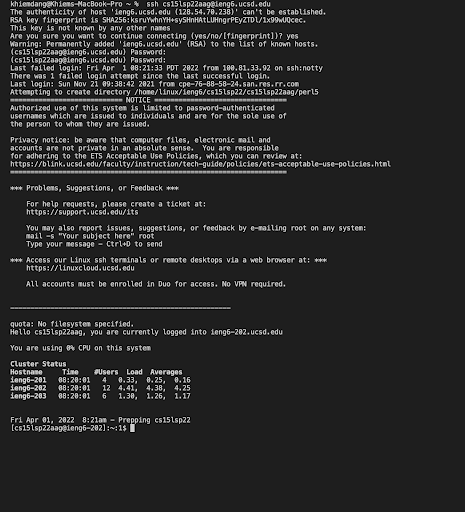
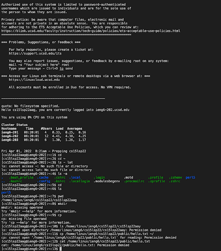
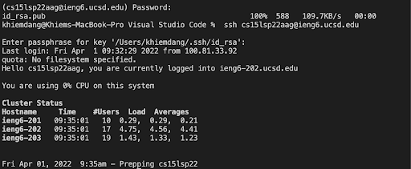

# Lab Report 1 Week 2

## Installing VSCode

I downloaded [Studio Visual Code](https://code.visualstudio.com/) for my operating system (MacOS). Once it was installed, I should saw a window like this:

---
 

## Remotely Connecting

I opened up a new terminal in VSCode and typed this command:

    ssh cs15lsp22aag

I got a message that looks like this:

    The authenticity of host 'ieng6.ucsd.edu (128.54.70.227)' can't be established.
    RSA key fingerprint is 
    SHA256:ksruYwhnYH+sySHnHAtLUHngrPEyZTDl/1x99wUQcec.
    Are you sure you want to continue connecting (yes/no/[fingerprint])?

And I typed "yes" into the terminal and entered my password.

My terminal is now connected to a server in the CSE basement.

---
 

## Trying Some Commands

I tried these commands on the remote server:

    cd ~
    cd
    ls -lat
    ls -a
    ls /home/linux/ieng6/cs15lsp22/cs15lsp22abc
    cp /home/linux/ieng6/cs15lsp22/public/hello.txt ~/
    cat /home/linux/ieng6/cs15lsp22/public/hello.txt

---
 

## Moving Files with scp

I created a new file on my comupter called WhereAmI.java and put this code into it:

    class WhereAmI {
    public static void main(String[] args) {
        System.out.println(System.getProperty("os.name"));
        System.out.println(System.getProperty("user.name"));
        System.out.println(System.getProperty("user.home"));
        System.out.println(System.getProperty("user.dir"));
        }
    }

Then I ran the file using javac and java on my computer and then ran this command:

    scp WhereAmI.java cs15lsp22zz@ieng6.ucsd.edu:~/

It asked for my password and I put my password in. I logged into ieng6 with ssh again and used ls to see the file in my home directory. I then ran it on the server using javac and java.

---
 

## Setting an SSH Key

On my computer, I put in this command.

    ssh-keygen

I got a message like this:

    Generating public/private rsa key pair.
    Enter file in which to save the key (/Users/khiemdang/.ssh/id_rsa): /Users/khiemdang/.ssh/id_rsa

I did not enter a passphrase and I got another message like this.

    Enter same passphrase again: 
    Your identification has been saved in /Users/khiemdang/.ssh/id_rsa.
    Your public key has been saved in /Users/khiemdang/.ssh/id_rsa.pub.
    The key fingerprint is:
    SHA256:jZaZH6fI8E2I1D35hnvGeBePQ4ELOf2Ge+G0XknoXp0 khiemdang@MacBook.local
    The key's randomart image is:
    +---[RSA 3072]----+
    |                 |
    |       . . + .   |
    |      . . B o .  |
    |     . . B * +.. |
    |      o S = *.B. |
    |       = = O.*.*+|
    |        + * *.BE+|
    |           +.+.o |
    |             ..  |
    +----[SHA256]-----+

Now I needed to copy the public key to the .ssh directory of my account on the server:

    ssh cs15lsp22zz@ieng6.ucsd.edu
    <Entered Password>

    mkdir .ssh
    exit

    scp /Users/khiemdang/.ssh/id_rsa.pub cs15lsp22aag@ieng6.ucsd.edu:~/.ssh/authorized_keys

---
 

## Optimizing Remote Running

I tried some commands that optimize the process for copying files to the remote server and running the files.

Writing a command in quotes at the end of a ssh command directly runs it on the remote server. I wrote a command that logs in the server and lists the home directory on the server:

    ssh cs15lsp22aag@ieng6.ucsd.edu "ls"

Using semicolons runs multiple commands in the same line. I wrote this command to copy the contents of a file onto another file and then ran javac and java:

    cp WhereAmI.java OtherMain.java; javac OtherMain.java; java WhereAmI

