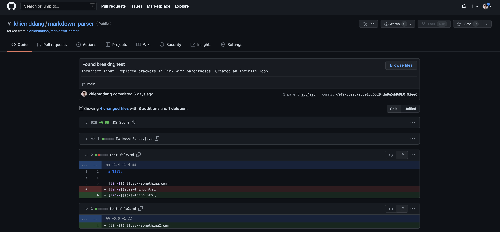
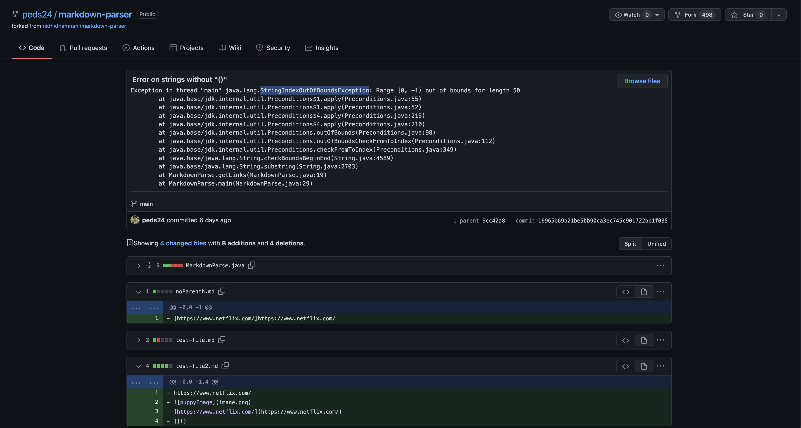
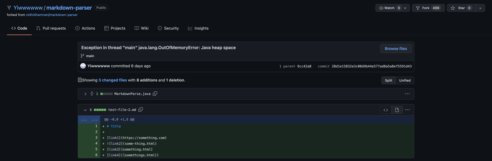

# Lab Report 2 Week 4

## Code Change 1

Enclosing the link text in parentheses instead of brackets is a failure-inducing input. The input created a bug where there was an infinite loop since the program continously searched for the brackets in the text file. The symptom of this input and bug was an OutOfMemoryError.

[Link to test file](https://github.com/khiemddang/markdown-parser/blob/main/test-file2.md)

The symptom of the failure-inducing input:

    Exception in thread "main" java.lang.OutOfMemoryError: Java heap space
            at java.base/java.util.Arrays.copyOf(Arrays.java:3512)
            at java.base/java.util.Arrays.copyOf(Arrays.java:3481)
            at java.base/java.util.ArrayList.grow(ArrayList.java:237)
            at java.base/java.util.ArrayList.grow(ArrayList.java:244)
            at java.base/java.util.ArrayList.add(ArrayList.java:454)
            at java.base/java.util.ArrayList.add(ArrayList.java:467)
            at MarkdownParse.getLinks(MarkdownParse.java:25)
            at MarkdownParse.main(MarkdownParse.java:37)

---
 

## Code Change 2

The second failure-inducing input causes an bug on strings without parentheses. When there is no parentheses in the text file, the program assigns the parentheses to an index value of -1, which is out of bounds for the string's length. The symptom of this is a StringIndexOutOfBoundsException.

[Link to test file](https://github.com/peds24/markdown-parser/blob/main/noParenth.md)

The symptom of the failure-inducing input:

    Exception in thread "main" java.lang.StringIndexOutOfBoundsException: Range [0, -1) out of bounds for length 50
            at java.base/jdk.internal.util.Preconditions$1.apply(Preconditions.java:55)
            at java.base/jdk.internal.util.Preconditions$1.apply(Preconditions.java:52)
            at java.base/jdk.internal.util.Preconditions$4.apply(Preconditions.java:213)
            at java.base/jdk.internal.util.Preconditions$4.apply(Preconditions.java:210)
            at java.base/jdk.internal.util.Preconditions.outOfBounds(Preconditions.java:98)
            at java.base/jdk.internal.util.Preconditions.outOfBoundsCheckFromToIndex(Preconditions.java:112)
            at java.base/jdk.internal.util.Preconditions.checkFromToIndex(Preconditions.java:349)
            at java.base/java.lang.String.checkBoundsBeginEnd(String.java:4589)
            at java.base/java.lang.String.substring(String.java:2703)
            at MarkdownParse.getLinks(MarkdownParse.java:19)
            at MarkdownParse.main(MarkdownParse.java:29)

---
 

## Code Change 3

This failure-inducing input is also similar to Code Change 1. In this case, the link itself is enclosed in brackets instead of parentheses. It creates a bug where the program assigns the parentheses to an index value of -1 when there are no parentheses in the text file. So the code starts at index 0 and then ends at index -1. The symptom is a StringIndexOutOfBoundsException.

[Link to test file](https://github.com/Yiwwwwww/markdown-parser/blob/main/test-file-2.md)

The symptom of the failure-inducing output:

    Exception in thread "main" java.lang.StringIndexOutOfBoundsException: begin 0, end -1, length 29
            at java.base/java.lang.String.checkBoundsBeginEnd(String.java:4601)
            at java.base/java.lang.String.substring(String.java:2704)
            at MarkdownParse.getLinks(MarkdownParse.java:25)
            at MarkdownParse.main(MarkdownParse.java:37)

