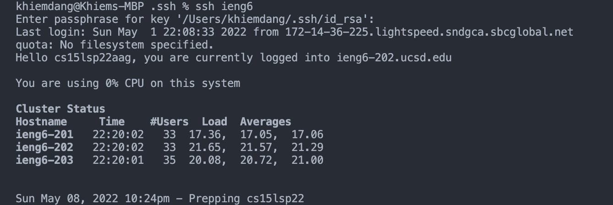
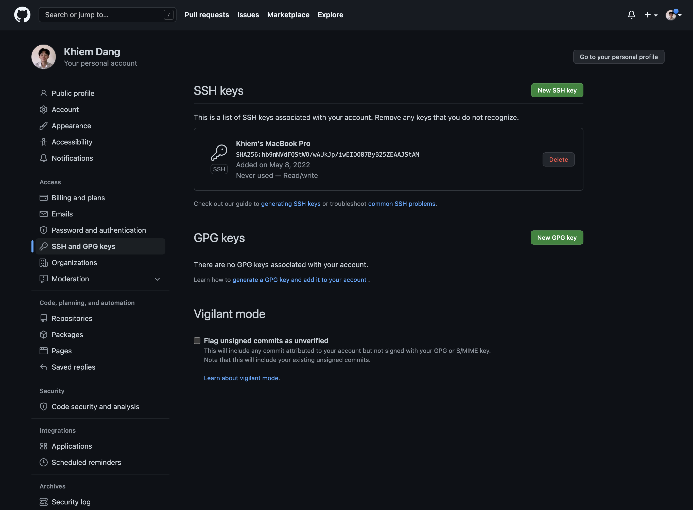
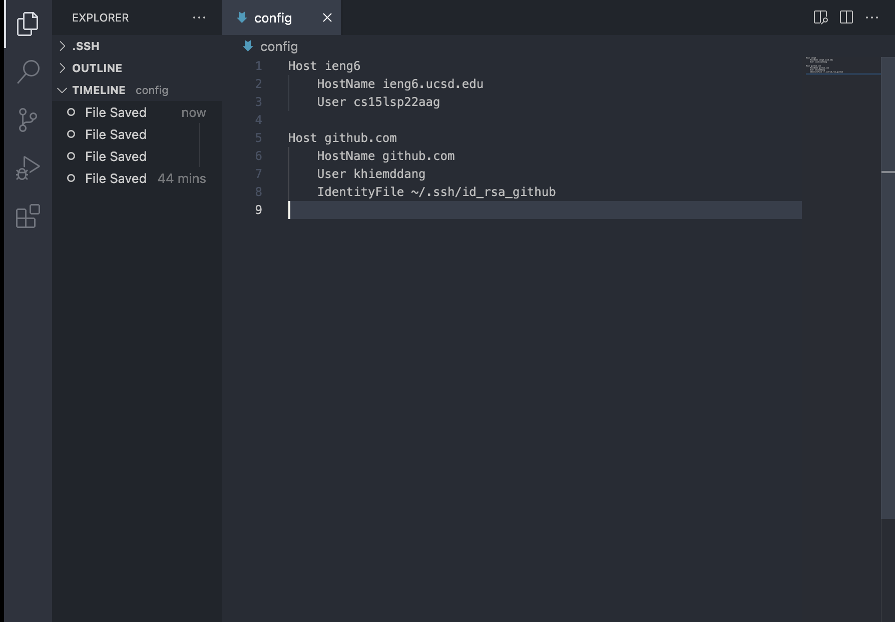

# Lab Report 3 Week 6

## Streamlining ssh Configuration

In order to streamline ssh configuration, I created a configuration file that tells SSH what username to use when logging into the remote server. I used VS Code to create a file in the .ssh folder with:

    touch config

Then I opened the config file with VS Code and added these lines:

    Host ieng6
        HostName ieng6.ucsd.edu
        User cs15lsp22aag

Now, I can use this command to log in:

    ssh ieng6

---
 

## Setup Github Access from ieng6

I copied the SSH public key to my clipboard with:

    pbcopy < ~/.ssh/id_rsa.pub

Then on GitHub, I added a new SSH key and pasted my key and added the SSH key to my GitHub.

I made another key so I access GitHub from my computer. I added these lines of code to my .ssh/config file:

    Host github.com
    HostName github.com
    User khiemddang
    IdentityFile ~/.ssh/id_rsa_github

And I generated a new private key with:

    ssh-keygen

And saved it to /Users/khiemddang/.ssh/id_rsa_github.

