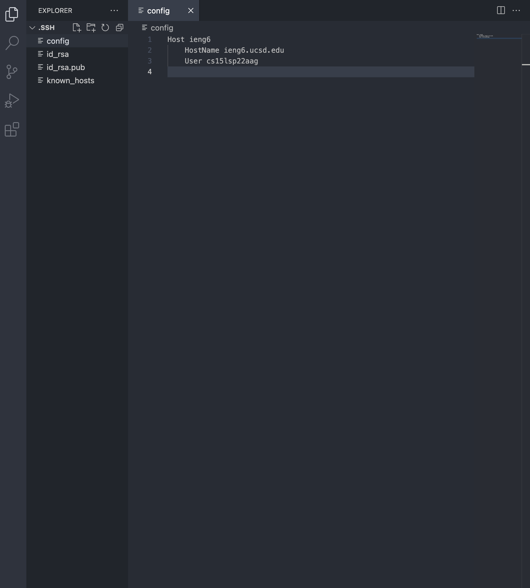
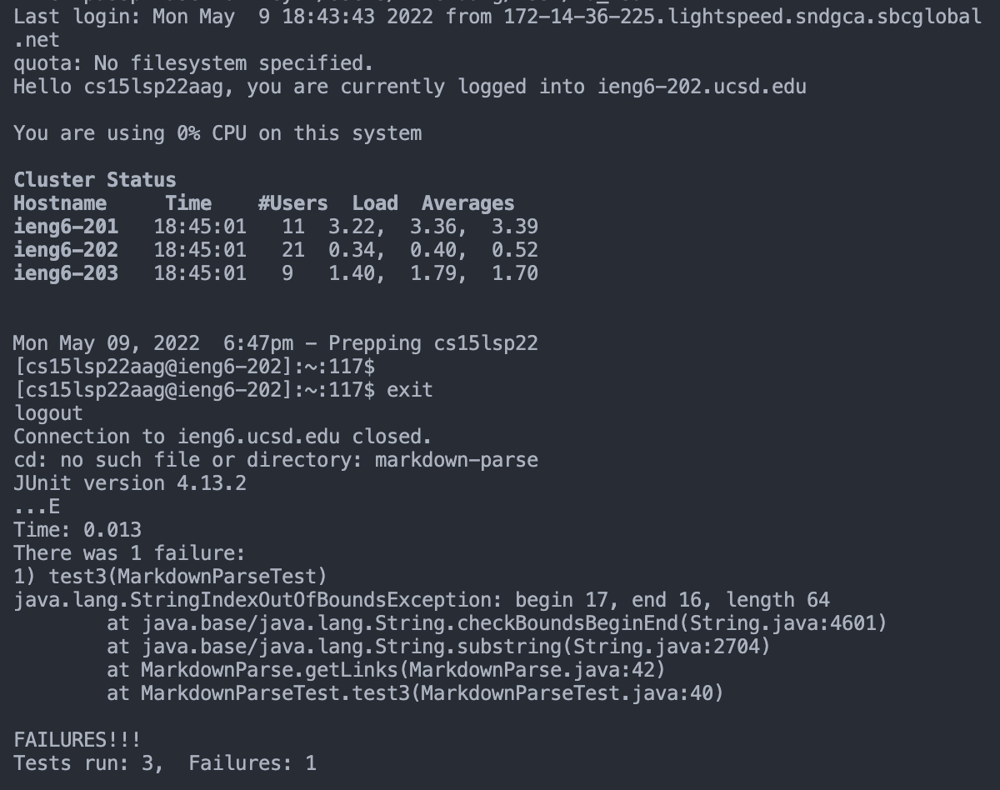

# Lab Report 3 Week 6

## Streamlining ssh Configuration

In order to streamline ssh configuration, I created a configuration file that tells SSH what username to use when logging into the remote server. I used VS Code to create a file in the .ssh folder with:

    touch config

Then I opened the config file with VS Code and added these lines:

    Host ieng6
        HostName ieng6.ucsd.edu
        User cs15lsp22aag

Now, I can use this command to log in:

    ssh ieng6

Then, I copied index.md to my account using the alias I chose.

---
 

## Setup Github Access from ieng6

I copied the SSH public key to my clipboard with:

    pbcopy < ~/.ssh/id_rsa.pub

Then on GitHub, I added a new SSH key and pasted my key and added the SSH key to my GitHub.

I made another key so I access GitHub from my computer. I added these lines of code to my .ssh/config file:

    Host github.com
        HostName github.com
        User khiemddang
        IdentityFile ~/.ssh/id_rsa_github

And I generated a new private key with:

    ssh-keygen

And saved it to /Users/khiemddang/.ssh/id_rsa_github.

Now I can run git commands to commit and push a change to GitHub while logged into my ieng6 account

[Here is the link for the resulting commit](https://github.com/khiemddang/cse15l-lab-reports/commit/47b7ed808c386e0e5b885ec331bfb505443a6ee8)

---
 

## Copy Whole Directories with scp -r

To copy the markdown-parse directory to the ieng6 remote sever, I used:

    scp -r . cs15lsp22@ieng6.ucsd.edu:~/markdown-parse

Then I logged into my ieng6 account and compiled and ran the JUnit tests for my repository.

In order to streamline all these steps, I combined all of the commands to copy the whole directory and run the tests in one line:

    scp -r . cs15lsp22aag@ieng6.ucsd.edu:~/markdown-parse; ssh ieng6; cd markdown-parse; javac -cp .:lib/junit-4.13.2.jar:lib/hamcrest-core-1.3.jar MarkdownParseTest.java; java -cp .:lib/junit-4.13.2.jar:lib/hamcrest-core-1.3.jar org.junit.runner.JUnitCore MarkdownParseTest

