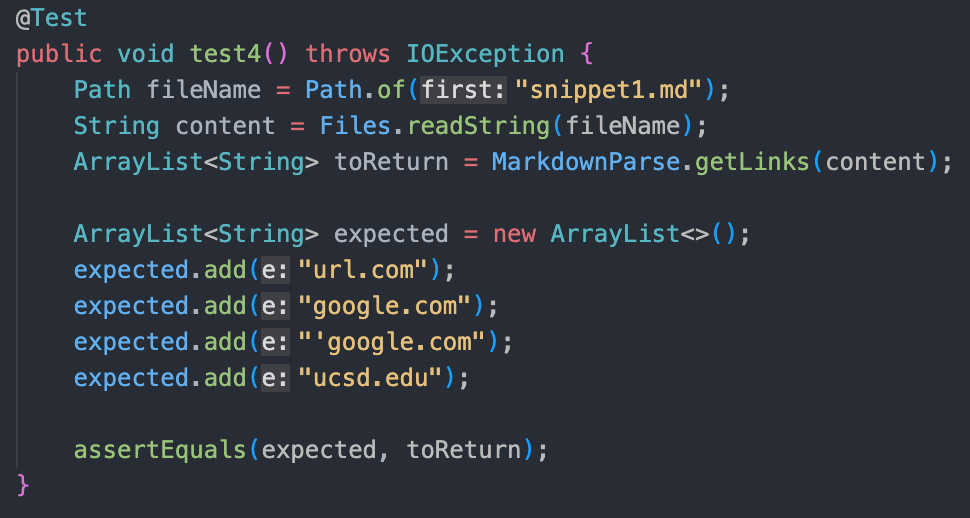
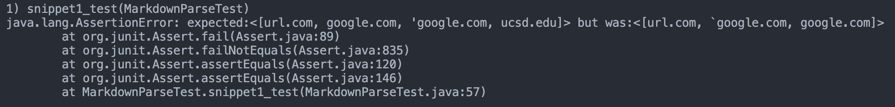

# Lab Report 4 Week 8

[My markdown-parse Repository](https://github.com/khiemddang/markdown-parser)

[Week 7 Reviewed markdown-parse Repository](https://github.com/TuannDang/markdown-parser)

---
 

## Snippet 1

    `[a link`](url.com)

    [another link](`google.com)`

    [`cod[e`](google.com)

    [`code]`](ucsd.edu)

### Expected Output:

    <[url.com, google.com, 'google.com, ucsd.edu]>

### Test:

### My Implementation:

My implementation failed for Snippet 1

### Implementation Reviewed in Week 7

---
 

## Snippet 2

    [a [nested link](a.com)](b.com)

    [a nested parenthesized url](a.com(()))

    [some escaped \[ brackets \]](example.com)

## Questions:

- Do you think there is a small (<10 lines) code change that will make your program work for snippet 1 and all related cases that use inline code with backticks? If yes, describe the code change. If not, describe why it would be a more involved change.

    - 

 

- Do you think there is a small (<10 lines) code change that will make your program work for snippet 2 and all related cases that nest parentheses, brackets, and escaped brackets? If yes, describe the code change. If not, describe why it would be a more involved change.

    -

 

- Do you think there is a small (<10 lines) code change that will make your program work for snippet 3 and all related cases that have newlines in brackets and parentheses? If yes, describe the code change. If not, describe why it would be a more involved change.

    -