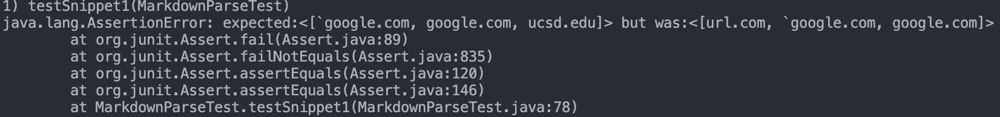

# Lab Report 4 Week 8

[My markdown-parse Repository](https://github.com/khiemddang/markdown-parser)

[Week 7 Reviewed markdown-parse Repository](https://github.com/TuannDang/markdown-parser)

---
 

## Snippet 1

    `[a link`](url.com)

    [another link](`google.com)`

    [`cod[e`](google.com)

    [`code]`](ucsd.edu)

### Expected Output:

The image below shows how Snippet 1 was formatted on VS Code preview.

### Test:

I created my tests based on what was displayed when I copied and pasted the markdown snippets onto VS Code. 

### My Implementation:

After running the JUnitTest on my implementation, my implementation failed for Snippet 1.

### Implementation Reviewed in Week 7

The implementation reviewed in Week 7 also failed for Snippet 1.

---
 

## Snippet 2

    [a [nested link](a.com)](b.com)

    [a nested parenthesized url](a.com(()))

    [some escaped \[ brackets \]](example.com)

### Expected Output:

The image below shows how Snippet 2 was formatted on VS Code preview.

### Test:

I created my tests based on what was displayed when I copied and pasted the markdown snippets onto VS Code. 

### My Implementation

After running the JUnitTest on my implementation, my implementation failed for Snippet 2.

### Implementation Reviewed in Week 7

The implementation reviewed in Week 7 also failed for Snippet 2.

---
 

## Snippet 3

    [this title text is really long and takes up more than 
    one line

    and has some line breaks](
        https://www.twitter.com
    )

    [this title text is really long and takes up more than 
    one line](
    https://sites.google.com/eng.ucsd.edu/cse-15l-spring-2022/schedule
    )

    [this link doesn't have a closing parenthesis](github.com

    And there's still some more text after that.

    [this link doesn't have a closing parenthesis for a while](https://cse.ucsd.edu/

    )

    And then there's more text

### Expected Output: 

The image below shows how Snippet 3 was formatted on VS Code preview.

### Test:

I created my tests based on what was displayed when I copied and pasted the markdown snippets onto VS Code. 

### My Implementation

After running the JUnitTest on my implementation, my implementation failed for Snippet 3.

### Implementation Reviewed in Week 7

The implementation reviewed in Week 7 also failed for Snippet 3.

---
 

## Questions:

- Do you think there is a small (<10 lines) code change that will make your program work for snippet 1 and all related cases that use inline code with backticks? If yes, describe the code change. If not, describe why it would be a more involved change.

    - 

 

- Do you think there is a small (<10 lines) code change that will make your program work for snippet 2 and all related cases that nest parentheses, brackets, and escaped brackets? If yes, describe the code change. If not, describe why it would be a more involved change.

    -

 

- Do you think there is a small (<10 lines) code change that will make your program work for snippet 3 and all related cases that have newlines in brackets and parentheses? If yes, describe the code change. If not, describe why it would be a more involved change.

    -