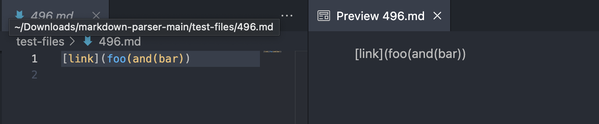
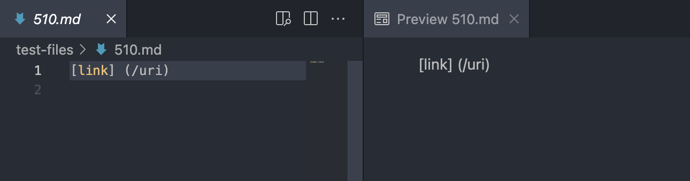

# Lab Report 5 Week 10

I used `bash script.sh > results.txt` on both the TA's and my implementation to save the output to a file rather than to be printed at the terminal.

In order to compare the results of the two implementations, I ran the command `vimdiff markdown-parser/results.txt cse15lsp22-markdown-parser/results.txt` 

On the left side is the output of my implementation and on the right side is the output of the implementation provided by the TAs.

---
 

## Test File 496

I used vimdiff on the results to find tests with different results. I decided to use [Test File 496](https://github.com/nidhidhamnani/markdown-parser/blob/main/test-files/496.md).

With this test file, we expect our program to not return any links since there are no valid links provided.

Here is the output of my implementation:

And here is the output of the TA provided implementation:

My implementation returned the incorrect output and the TA's implementation returned the correct output.

### The bug?

The bug lies within my getLinks() method causing my implementation to produce the wrong ouput. In order to fix this bug, I would need to add some code that to check for invalid links. In this case, I would need to add code that checks for extra parentheses within openParen and closeParen. If there are extra parentheses, my implementation shoud return nothing as the link.

---
 

## Test File 510

Again, I used vimdiff to compare and find tests with different results. This time, I decided to use [Test File 510](https://github.com/nidhidhamnani/markdown-parser/blob/main/test-files/510.md).

For Test File 510, we expect our program to not return any links since there are no valid links in the file due to the extra space between the closed bracket and the open parenthesis.

Here is the output of my implementation:

And here is the output of the TA provided implementation:

My implementation returned the correct output this time and the TA's implementation returned the incorrect output.

### The bug?

The bug lies within the provided implementation's getLinks() method causing the implementation to produce the wrong output. In order to fix this bug, code should be added to check for extra spaces between closeBracket and OpenParen. If there is a space (or spaces) between the closed bracket and open parenthesis, the implementation should return nothing for the link.

